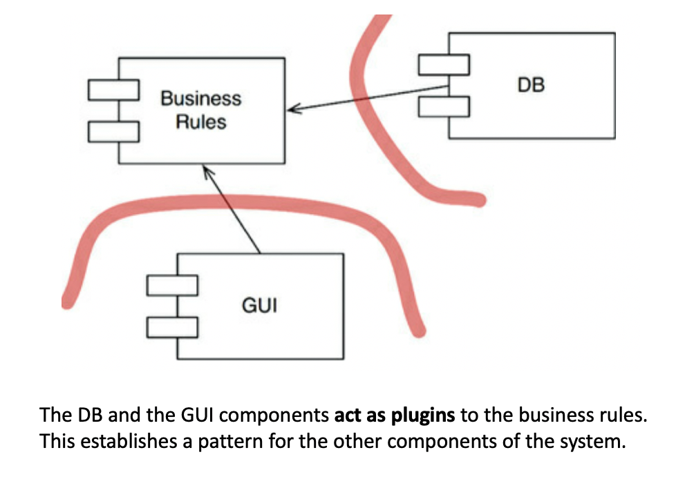

# **Summary**

-   [So what is Architecture ?](#so-what-is-architecture)
    -   [Facilitate Development](#facilitate-development)
        -   [The Paradox of Small Teams](#the-paradox-of-small-teams)
        -   [Large Teams](#large-teams)
    -   [Facilitate Deployment](#facilitate-deployment)
    -   [Facilitate Operation](#facilitate-operation)
    -   [Good Architecture: Keeping Options Open](#good-architecture-keeping-options-open)
-   [Vertical and Horizontal Layers and Independence](#vertical-and-horizontal-layers-and-independence)
    -   [Vertical Layers and Operation Performance](#verticle-layers-and-operation-performance)
    -   [Layers and Independent Develop-Ability](#layer-and-independent-develop-ability)
    -   [The Fear of Duplication Trap](#the-fear-of-duplication-trap)
    -   [Decoupling Modes](#decoupling-modes)
-   [Boundaries: Drawing Lines](#boundaries-drawing-lines)
    -   [What Makes A Software Difficult To Maintain?](#what-makes-a-software-difficult-to-maintain)
    -   [The Relationship Between The Database And The Business Rules](#the-relation-ship-between-the-database-and-the-business-rules)
-   [The Plugin Architecture - The Foundational Idea of Clean Architecture](#the-plugin-architecture-the-foundation-ida-of-clean-architecture)
    -   [Boundary Anatomy](#boundary-anatomy)
        -   [What is boundary crossing](#what-is-boundary-crossing)
        -   [Boundaries and Monoliths](#boundaries-and-monoliths)
        -   [Are Threads Boundaries?](#are-threads-boundaries)
        -   [Are Local Processes Boundaries](#are-local-processes-boundaries)
        -   [Are Services Boundaries](#are-services-boundaries)
-   [Policy and Level](#policy-and-level)
-   [Business Rules](#business-rules)
    -   [Entities (Application-Independent Business Rules)](#entities-application-independent-business-rules)
    -   [Use Cases (Application-Specific Business Rules)](#use-cases-application-specific-business-rules)
    -   [Requests and Response Models](#requests-and-response-models)

# **So what is Architecture**?

The architecture of a software is the composition, shape, communication mechanisms between the components that make the software. The purpose is to facilitate development, deployment, operation and maintenance, optimising to minimize lifetime maintenance cost and maximize programmer productivity.

## **Facilitate Development**:

The architecture must make it possible for the teams to organize as they need without interfering with each other.

### **The Paradox of Small Teams**

-   Small teams of say 5 developers can work effectively on a monolithic system without well-defined components. Furthermore, they will probably find the strict rules of architecture to reduce their productivity during the early days of development.

-   This is why so many systems lack good architecture: They begun with none because the team was small and did not want the impediment of a superstructure.

### **Large Teams**:

-   A system being developed by five different teams, each with seven developers will not make progress until the system is divided into well-defined components with stable interfaces.

-   If no one thinks about the architecture, the teams will naturally gravitate to a 5-component architecture (one per team). This will likely not be the best architecture for deployment, operation and maintenance.

## **Facilitate Deployment**:

-   Ease of deployment of the whole system with a single action is often overlooked, especially during early stages of development, and is a critical concern of architecture.

-   The extreme case of neglecting ease of deployment is the blind early adoption of a "micro-service architecture".

## **Facilitate Operation**:

Operation is seen from 2 optics in this section:

-   Operation Performance in Hardware.
-   Cognitive load to understand the what the software does

Architecture is more related to the second optic that to the first one.

### **Operation Performance**:

-   Performance problems can almost always be solved by throwing more hardware at them

-   People are more expensive than hardware. Unless the performance is horrible, the cost of bad performance is typically much lower than the cost of hard develop-ability, deployment or maintenance.

### **Cognitive Load**:

Cognitive easiness of what the software does is the critical bit from the operation point of view because it makes development and maintainability easier.

## **Facilitate Maintenance**:

-   Of all the aspects of a software system, maintenance is the most costly.

-   The main component of maintenance cost is in **speluking** and **risk**.

-   A carefully though-through architecture vastly mitigates this costs and illuminates the pathway for future features.

## **Good Architecture: Keeping Options Open**:

> **Reminder**: Software has two types of value: the value of its **behavior** and the value of its **structure**. The second of these is the greater of the two because it is this value that makes software soft.

On a very high-level, software systems can be divided into 2 elements: policies and details.

-   **Policies**: business rules and procedures.
-   **Details**: things that are necessary for humans and other systems to communicate with the policy but that not impact the policy at all (e.g. They include IO devices, databases, web systems, servers, frameworks, communication protocols, and so forth).

The goal of the architect is to create a shape for the software that recognizes the policies as the main elements and keeping the details relevant to them.

# **Vertical and Horizontal Layers and Independence**

**Goal**: Rxplores the idea of thinking about software systems as horizontal and vertical layers and shows how that layered thinking supports the architecture goals presented in the previous chapter: Operation, Develop-ability, Deploy-ability (and implicitly maintainability).

## **Thinking in Layers**:

-   **Vertical Layers**: related to what the system does (use cases). Use cases change for different reasons and different rates from each other, therefore, they should be protected from each other.
-   **Horizontal Layers**: related to the functional purpose of the layer in the code (e.g persistence).

## **Vertical Layers and Operation Performance**:

-   The concept of vertical separation by use cases enables a powerful idea: if we absolutely needed to support high throughput for a particular use case, we already have a natural place where to cut without too much changes as the software is already modularized.

-   By making the vertical separation strict, avoiding any assumption that other use-cases are accessible via the same machine, use-cases can be deployed and scaled independently as services / micro-services

## **Layers and Independent Develop-Ability**

**Horizontal layers** give us the possibility of.

-   **For example**: compiling the UI or persistence layers of a use-case independently from its business logic.

**Vertical layers** give us a similar possibility, and optionally we could take it to the point of deploying to different micro-services

## **The Fear of Duplication Trap**:

Many architectures get damaged because of the fear of **duplication**

Duplication is generally considered a bad thing in software. There is an important distinctions between 2 types of duplication:

-   **True (bad) duplication** happens when the exact same code or logic is truly repeated in multiple places and every time a change happens, we need to change all places.

-   **False (accidental) duplication** is where two apparently duplicated sections of code evolve along different paths, change at different rates and for different reasons.

Architectures get damaged when developers unify pieces of accidental duplication because separating them as they take different paths is really challenging.

## **Decoupling Modes**

**Decoupling modes** are different levels of actual decoupling we can achieve by changing how components communicate with each other. It can be listed as below:

-   **Source Level**
-   **Deployment Level**
-   **Service Level**

# **Boundaries: Drawing Lines**

> Some of those lines are drawn very early in a project’s life—even before any code is written. Others are drawn much later. Those that are drawn early are drawn for the purposes of deferring decisions for as long as possible, and of keeping those decisions from polluting the core business logic.

### **What makes a software difficult to maintain?**

**Coupling**, especially coupling to premature decisions.

**`Important`**: Premature decisions are decisions that hove nothing to do with the business logic / use cases. E.g. frameworks, data-bases, web servers, libraries, etc.

### **The relationship between the database and the business rules**:

Often people think that the database is inextricably connected to the business rules. This is not true. The business rules only need to know that there is a set of functions to fetch and save data, meaning that the DB can be hidden behind an interface.

**`Note`**: In a real application there would be many business rules classes, many databases interfaces and many classes that implement those interfaces to access the database.

### **The role of the GUI in the system**:

-   People often thing that the GUI is the system and therefore should be developed first. This is not true, the GUI is a simple IO device. **The system is the set of business rules that drive it and therefore they should be developed first.**

## **The Plugin Architecture - The Foundational Idea of Clean Architecture**

    

-   Making the DB and GUI act as plugins to the business rules we have made it possible to implement and swap different GUIs (e.g web based, SOA based, console based) and Databases (SQL, NoSQL, file system).

-   The business rules that determine which operations need to be supported by whatever GUI and Persistence mechanism we decide to use and it is up to those plugins to implement them.

-   The point being made here is that by adopting the plugin idea we at least have made this changes but not affect to **business logic**

## **Boundary Anatomy**

The boundaries that separate components in a software's architecture come in man different forms

### **What is boundary crossing** ?

-   In software, boundaries are crossed when a function on one side of the boundary calls a function on the other side of the boundary.

-   Depending on the [Decoupling Mode](#decoupling-modes), this call can be an inexpensive call to another function in the same project.

### **Boundaries and Monoliths**

-   Boundaries can exist even if all the code is in the same project (a monolith) using **source-level decoupling.**

-   Furthermore it is possible to have monoliths with no boundaries. Those projects will suffer from develop-ability, maintenance, etc difficulties despite having all the code in a single project.

-   Disciplined partitioning of code into components using boundaries can greatly aid developing, testing and deployment of the project.

### **Are Threads Boundaries?**

> Threads are not architectural boundaries or units of deployment, but rather a way to organize the schedule and order of execution.

The calls that a threaded code makes may be entirely contained within a component or spread across multiple components.

### **Are Local Processes Boundaries**?

Yes, a software that runs different parts in different local processes has a strong physical boundaries between the processes that are enforced by the operating system.

### **Are Services Boundaries**?

-   **Yes, it is the strongest boundary**.

-   The general idea of plugin architecture also holds: low-level services should act as a plugin to higher level ones.

# **Policy and Level**

Clean architecture fundamental idea of higher-level policies should not depend on low-level details is supported on a notion of component level that we have not explored formally yet.

A possible definition of a component level is the minimum number of steps needed to reach either the input and the output. The larger the number of steps, the higher the level.

**Why is this notion of level important?**

> Higher-level policies—those that are farthest from the inputs and outputs—tend to change less frequently, and for more important reasons, than lower-level policies. Lower-level policies—those that are closest to the inputs and outputs—tend to change frequently, and with more urgency, but for less important reasons.

# **Business Rules**

The simple definition of **business rules** is a procedure that helps the business make or save money.

To divide our app into **business rules** (policies) and plugins, we better know what **business rules** are.

## **Entities (Application-Independent Business Rules)**

There are procedures that would exist in the business even if they were not automated and had to be executed manually. We call these procedures Critical Business Rules.

An **Entity** is an object within our software that represents the union of critical business rules operating on critical business data.

-   The entity should either hold the critical business data OR have very easy access to it.
-   The entity does not know anything about databases, user interfaces or third-party frameworks.
-   In an object-oriented language the entity may be a class, but in other paradigms it can be whatever construct allows to bind data and behaviour together (all programing paradigms have this concept).

## **Use Cases (Application-specific Business Rules)**

They are **business rules** that make or save money by defining the way the automated system operates. They wouldn't exist if the business operated in a manual environment.

**Important points about use cases:**

-   Each use case is a description of the way the system is used.
-   They specify the input provided by the user, the processing steps and the output returned.
-   It uses other data elements to represent input data and output data.
    They specify how and when the Entities' Critical Business Rules are invoked.
-   Entities have no knowledge of the use cases that control them. Entities are at a higher-level than use cases and therefore do not depend on them.
    It does NOT describe the user interface. It only specifies the data to be passed in. Use cases don't know if they are part of a web-system, a desktop client, etc.
-   A use case is an object that has one or more functions that implement the application-specific business rules.

## **Requests and Response Models**

Since we want the use case to get input data and return output without coupling them to any particular type of I/O device (like the web or the DB), we need to introduce simple (non-web related) **Request** and **Response** models

**Request and Response have some rules**:

-   They should not know about the web or the DB.
-   They should not know about the framework.
-   They should not contain references to Entity objects.
    Despite probably sharing data with Entity objects, the purpose of these two objects is very different and they will change for very different reasons. Therefore this is accidental duplication and it is better to keep them separate.

**`Important`**: Not complying with the above will result in your use cases indirectly depending on things like the web or the framework.
