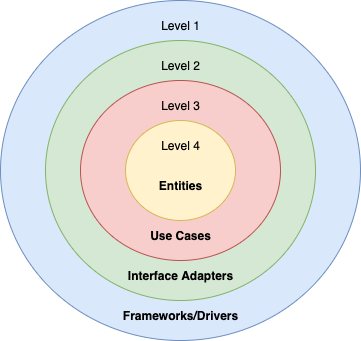
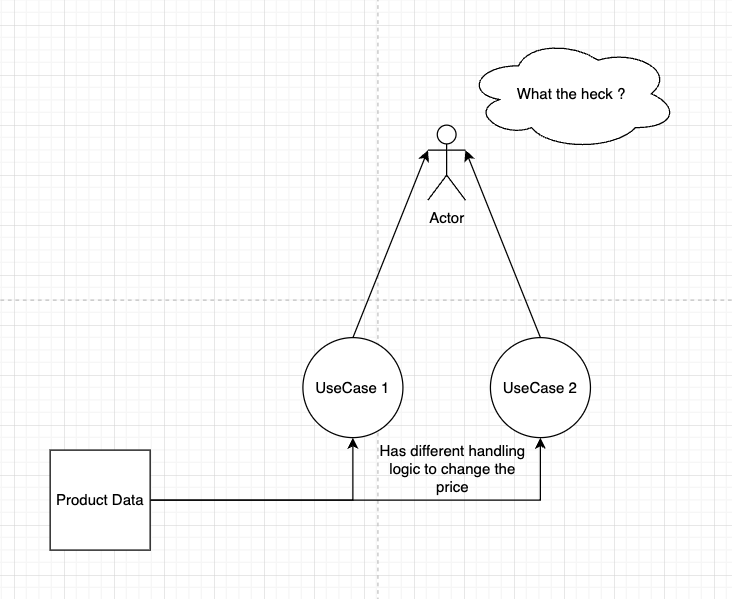
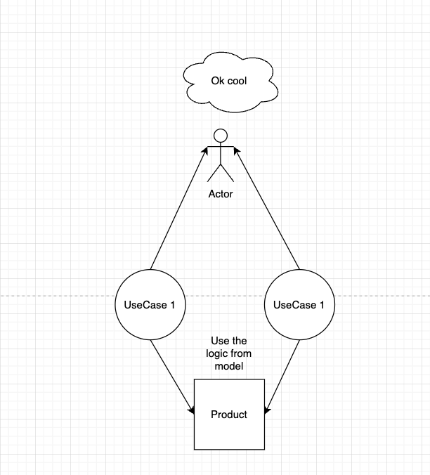
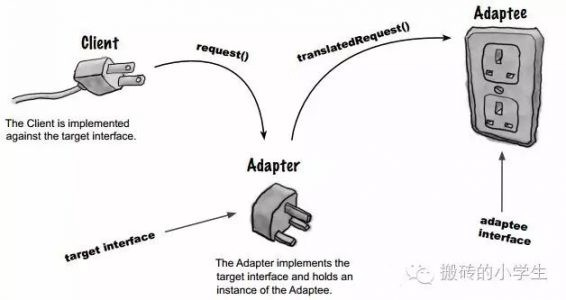
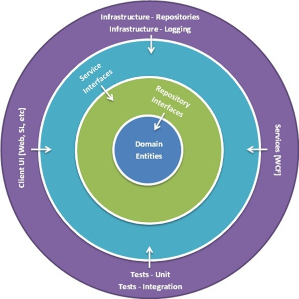

# **Summary**

-   [Clean Architecture](#clean-architecture)
    -   [Entity (Domain Centric)](#entity-domain-centric)
    -   [Use Case](#use-case)
    -   [Domain Service](#domain-service)
    -   [Infrastructure](#infrastructure)
-   [Another Architectures](#another-architectures)

# **Clean Architecture**

<p align="center">
  
</p>

Clean Architecture is using "DIP" (Dependency Inversion Principle) for every layer

## **Entity (Domain Centric)**

-   **Entity** is a normal model class.

-   Normally, we think model class actually only have data attributes and some get set functions.

-   Uncle Bob does not want entity to be a simple model class. He want entity should be a model centric.

-   **Domain Centric** is not only a class which contain the data attributes, but it also take care the behaviors logic of the business. It manages state data of the model.

**Example**:

```typescript
export interface ProductProps {
    // Define data here
    id: string;
    name: string;
    image: string;
    price: Price;
    defaultDiscount: DiscountPrice;
    timeBoxDiscountPrice: TimeBoxDiscountPrice;
    categoryId: string;
    quantity: number;
    views: number;
    status: ProductStatus;
    skus: ProductSku[];
}

export class Product extend Entity {
    constructor(private readonly props) {}

    public getProps() {
        return this.props;
    }

    public static create(props): Result<Product> {
        // Validate

        // Check logic
    }

    public updatePrice(price: number): Result<void> {
        // Implement logic
        ...

        this.props.price = price;
        super.update();
        return Result.ok();
    }

    public createDiscountPrice(price: number, expireTime: string):  Result<void> {
        // Implement logic
        ...
        return Result.ok();
    }

    public updateName(name: string) {
        this.props.name = this.props
        return Result.ok();
    }

    public updateStatus(status: ProductStatus): Result<void> {
        this.props.status = status;
        super.update();
        return Result.ok();
    }

    public increaseView() {
        this.props.views += 1;
        super.update();
        return Result.ok();
    }

    public addNewSku(sku: ProductSku): Result<void> {
        // Implement logic here
        ...
        return Result.ok();
    }

    public removeSku(id: string): Result<void> {
        // Implement logic here
        ...
        return Result.ok();
    }

    ...
    // More functions
}
```

### **Conclusion**

    - Every public functions are represent for every behavior logic of the business
    - Easy to write unit test without mocking (TDD)
    - Easy to understand overview of the business

## **Use Case**

What is **Use Cases** ?

-   Use case look like the **Domain Service.**

-   What is **Domain Service** ? **Domain Service** is the class interact on entity and **Infrastructure** (Database, Message Queue, ...).

## **Domain Service**

**Example**:

```typescript
export class ProductService implements IProductService {
    constructor (@Inject() private readonly productRepository: IProductRepository,
        @Inject() private readonly eventPublisher: IEventPublisher,
        @Inject() private readonly userService: IUserService,
        @Inject() private readonly productRedisService2: IProductRepository,
        @Inject() private readonly productRedisService1: IProductRepository,
        @Inject() logger: Logger) {
    }

    create(input) {
        // Implement logic

        const props: ProductProps = {
            // ... input here
        }
    }

    update(id, request){

    }

    findById(id) {

    }

    find(query) {

    }
    ...
    // More functions
}
```

What are problems of **Domain Service** ?

-   When using for specific logic, we have to inject unrelated instances object (ISP).

-   Big injections for multiple logic.

-   Merge conflict when having some developers are working on the same service.

-   Reading the code will become harder when domain service is become bigger.

-   All the unit test case fails when pulling code from Git.

-   When the file domain service is really big, git tools cannot open this file. Maybe you have to use the terminal to view the changed of the file. However, the terminals does not have a good UI to see => Your eyes will blow up.

**How can we solve these problems ?**

=> The **_Interface Segregation Principle (ISP)_**

Split every behavior logic to every file

**For example:**

```typescript
export class CreateProductUseCase extends UseCase<CreateProductInput, string> implement IUseCaseHandler {

    constructor(@Inject() productRepository: IProductRepository, @Inject() userService: IUserService)

    @Override
    async buildUseCase(input: CreateProductInput): Promise<Result<string>> {
        // Implement logic
        ...
        return Result.ok('Create product successfully);
    }
}

```

### **_Conclusion_**

-   Following the example, you probably understand the meaning of **Use Case**
-   Every **Use Case** have their own boundary.


### **_Concerns_**

- I split to multiple use cases, so I just handle business logic in UseCase instead of entity

<p align="center">
  
</p>

### Solution

<p align="center">
  
</p>
## **Adapter**

<p align="center">
  
</p>

To understand **Adapter** layer, you have to understand **Adapter Pattern.**

"Client" => "Adapter" => Adaptee
Adapter: Controller, Presenter, Gateways

**Example**:

**_Api Express controller_**

```typescript
@Controller('/products')
export class ProductController {
    constructor(private readonly createProductUseCase: CreateProductUseCase) {}

    @Post()
    async create(request): Promise<string> {
        const input: CreateUseCaseInput = {
            // transform request here
            name: request.name,
            image: request.image,
        };
        const response = await this.createProductUseCase.execute(input);
        return response;
    }
}
```

**_Lambda Handler_**

```typescript
export const createProductHandler = (event) => {

    // Validate event
    ...

    const { body } = event;

    const input: CreateUseCaseInput = {
        // transform request here
        name: body.name,
        image: body.image
    }
    const response = await this.createProductUseCase.execute(input);
    return response;
}
```

## **Infrastructure**

This layer is where all the I/O components go: the UI, database, frameworks, devices, etc. It’s the most volatile layer. Since the things in this layer are so likely to change, they are kept as far away as possible from the more stable domain layers. Because they are kept separate, it’s relatively easy make changes or swap one component for another.

=> Clean Architecture is applying DIP (Dependency Inversion Principle)
"Abstractions should not depend upon details. Details should depend on abstractions" - Entity layer doesn't depend on UseCase layer, but UseCase depend on Entity - UseCase layer doesn't depend on Adapter layer, but Adapter depend on UseCase - Adapter layer doesn't depend on Infrastructure, but Infrastructure depend on Adapter

=> Decoupling for every layers
# **Another Architectures**

-   Hexagonal Architecture (a.k.a. Ports and Adapters) by Alistair Cockburn and adopted by Steve Freeman, and Nat Pryce in their wonderful book Growing Object Oriented Software
    

-   Onion Architecture by Jeffrey Palermo
<div align="center">
    
</div>

Though these architectures all vary somewhat in their details, they are very similar. They all have the same objective, which is the separation of concerns.

They all achieve this separation by dividing the software into layers. Each has at least one layer for business rules, and another for interfaces.

Each of these architectures produce systems that are:

    1. Independent of Frameworks. The architecture does not depend on the existence of some library of feature laden software. This allows you to use such frameworks as tools, rather than having to cram your system into their limited constraints.
    2. Testable. The business rules can be tested without the UI, Database, Web Server, or any other external element.
    3. Independent of UI. The UI can change easily, without changing the rest of the system. A Web UI could be replaced with a console UI, for example, without changing the business rules.
    4. Independent of Database. You can swap out Oracle or SQL Server, for Mongo, BigTable, CouchDB, or something else. Your business rules are not bound to the database.
    6. Independent of any external agency. In fact your business rules simply don’t know anything at all about the outside world.

The diagram at the top of this article is an attempt at integrating all these architectures into a single actionable idea.
