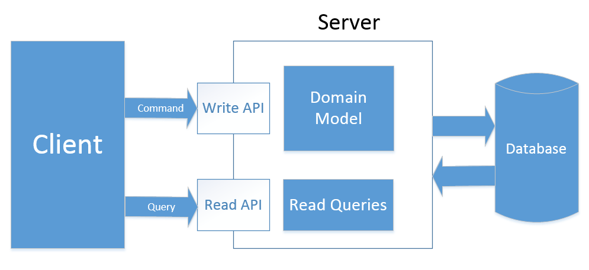
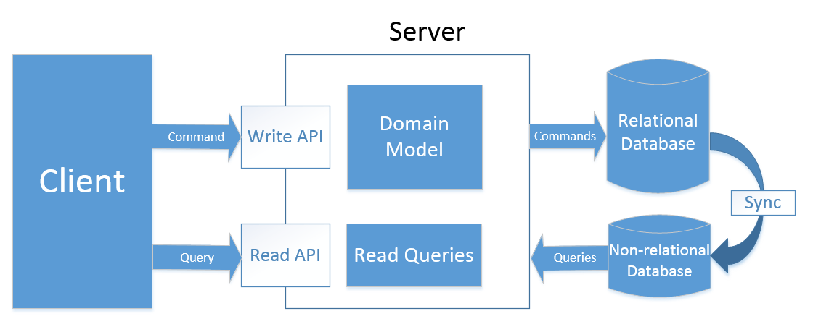

# **Conclusion**

-   Domain Centric (TDD)
-   Focus business
-   Don't focus technologies in the first time. Delay it as much as possible
-   Open many options/solutions for technical decisions
-   Depending on the time, we should consider to encapsulating the package of the project

## **Following On `Domain Centric`, I would like introduce two concepts**

-   CQRS (Command Query Responsibility Segregation):

**Type 2**:

**Type 3**:

-   DDD (Domain Driven Design)

