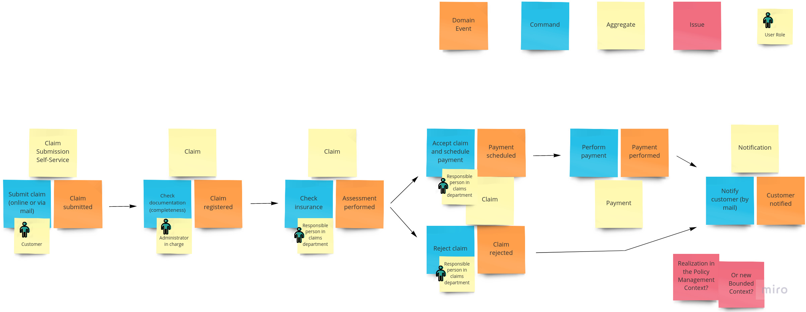
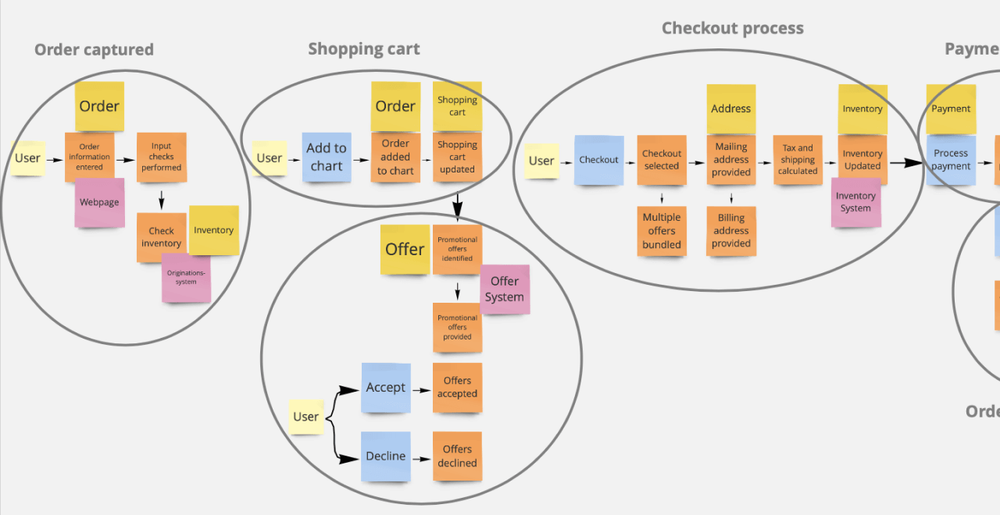
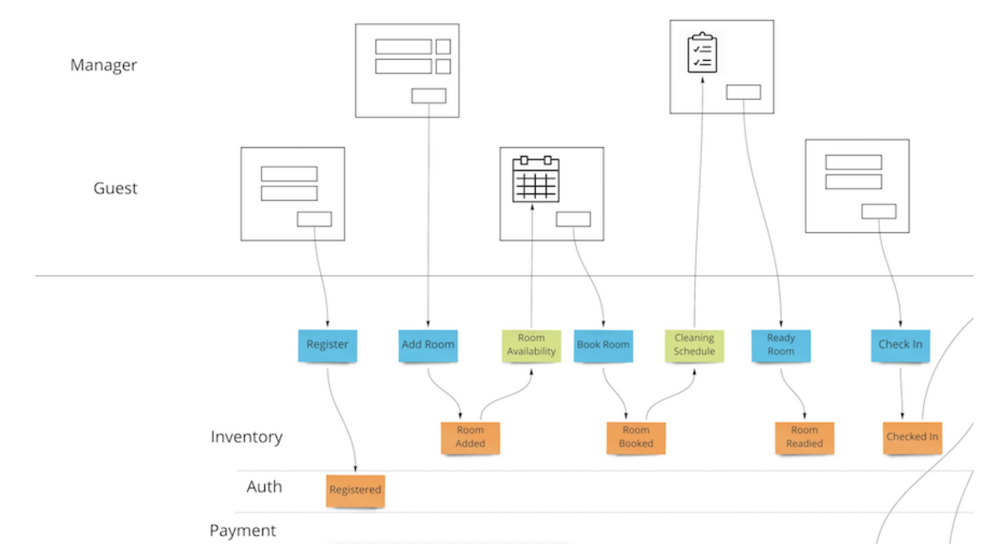

# Domain Drive Design

- Following on Clean Architecture & CQRS
- **Provide more principles to focus on Domain Centric**
    - Core Domain
    - Sub Domain
    - Aggregate
    - Value Object
    - Entity
    - Domain Event
    - Bounding Context
    - Context Map
    - Shared Model

## Event Storming

  

  

## Event Model 

  

## Shared Mental Model

  

